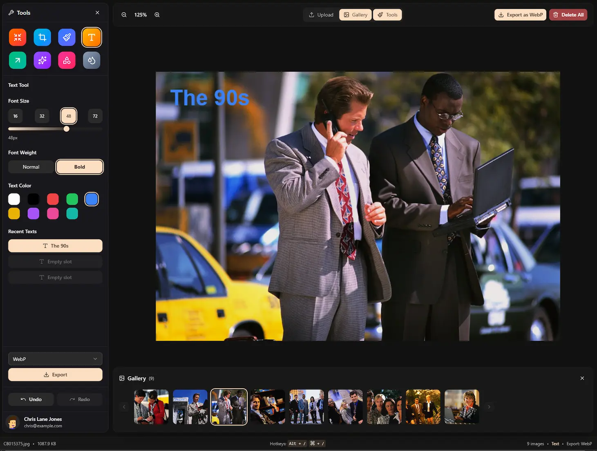

# Yet Another Image App



A powerful browser-based image annotation and editing tool built with React, TypeScript, and modern web technologies.

## Features

### Image Management
- **Multiple upload methods**: Drag & drop, file browser, or paste from clipboard (Ctrl+V)
- **Gallery view**: Paginated thumbnail gallery with delete functionality
- **Batch support**: Work with multiple images in a single session
- **Auto-open upload**: Upload dialog appears automatically when no images are loaded
- **Supported formats**: PNG, JPG, GIF, WebP, AVIF

### Annotation Tools

#### Compress & Resize
- Adjustable quality slider (10-100%)
- Resize with customizable width/height
- Lock aspect ratio toggle
- Apply resize button for instant resizing

#### Crop & Rotate
- Click and drag to select crop area with visual overlay
- Dashed selection border with darkened outside area
- Apply crop button to commit selection
- Flip horizontal/vertical
- Rotate left/right (90 degree increments)

#### Brush / Paint
- Freehand drawing with smooth strokes
- Size presets (4, 8, 16, 32px) + fine-tune slider
- Opacity control (10-100%) + slider
- 9 color palette with selection highlight
- **Emoji stamping**: Select an emoji to stamp instead of paint
  - Compact emoji picker (no search bar, minimal UI)
  - Click or drag to stamp emojis
  - Size scales with brush size
  - Clear button to return to normal brush

#### Text Tool
- Click anywhere on the image to add text
- **Multiple text boxes**: Add unlimited text annotations
- Font size presets (16, 32, 48, 72px) + slider (8-72px)
- Font weight toggle (Normal / Bold)
- 9 color palette for text color
- **Recent Texts Memory**: 3 memory marker buttons that save your recent text entries
  - Click a marker to restore text content and styling
  - Quickly reuse common annotations
- Press Enter to commit, Shift+Enter for new line, Escape to cancel

#### Arrow
- Click and drag to draw arrows
- **Single arrow** (one-headed) or **Double arrow** (two-headed)
- Stroke width presets (2, 4, 6, 8px) + slider
- 9 color palette
- Styled toggle buttons for arrow style selection

#### Shapes
- **Rectangle**: Draw rectangular outlines
- **Circle**: Perfect circles
- **Hand-drawn Circle**: Natural, sketchy circle style with organic feel
- **Line**: Straight lines
- Stroke width control
- 9 color palette

#### Blur Tool
- Brush-based blur for redacting sensitive information
- Adjustable blur size (8-128px)
- Blur intensity control (1-20px)
- Real-time preview cursor showing brush size

#### AI Tools
- **Background Removal**: One-click AI-powered background removal
- Powered by @imgly/background-removal
- Progress indicator during processing

### Canvas
- **Smooth zoom**: 25% - 200% with animated transitions
- Zoom controls in top bar (+/- buttons)
- Keyboard shortcuts for zoom (Alt +/-)
- Right-click context menu for quick actions
- Canvas smoothly animates when sidebar opens/closes

### Undo/Redo
- Full history support for all drawing operations
- Undo/redo buttons in sidebar
- Context menu access
- Keyboard shortcuts (Alt+Z / Alt+X)

### Export
- **Multiple formats**: JPEG, WebP, AVIF
- Quality setting affects export compression
- Format selector dropdown
- Quick export from context menu
- Copy to clipboard support

### UI/UX
- **Dark theme** with custom color palette
- **Animated panel entrance**: Top bar slides in first, then tools sidebar, then gallery (staggered 500ms intervals)
- Animated sidebar and gallery (Framer Motion spring physics)
- Keyboard hint badges (toggle with Alt+/)
- Status bar showing image info, tool, and export format
- Responsive layout with collapsible panels
- Delete all images with confirmation dialog

## Keyboard Shortcuts

| Shortcut | Action |
|----------|--------|
| `Alt + U` | Toggle upload dialog |
| `Alt + I` | Toggle image gallery |
| `Alt + S` | Toggle tools sidebar |
| `Alt + /` | Toggle keyboard hints |
| `Alt + Z` | Undo |
| `Alt + X` | Redo |
| `Alt + E` | Export |
| `Alt + D` | Delete all images |
| `Alt + -` | Zoom out |
| `Alt + =` | Zoom in |

On macOS, `Cmd` also works as a modifier.

## Tech Stack

- **React 19** - UI framework
- **TypeScript** - Type safety
- **Vite 7** - Build tool with HMR
- **Tailwind CSS 4** - Utility-first styling
- **Framer Motion** - Smooth animations
- **Radix UI** - Accessible UI primitives
- **Lucide React** - Icon library
- **emoji-mart** - Emoji picker
- **@imgly/background-removal** - AI background removal

## Getting Started

```bash
# Install dependencies
pnpm install

# Start development server
pnpm dev

# Build for production
pnpm build

# Preview production build
pnpm preview
```

The development server runs on `http://localhost:5173`.

## Project Structure

```
src/
├── app/
│   ├── App.tsx              # Root component
│   ├── AppShell.tsx         # Main layout & state management
│   └── useKeyboardShortcuts.ts
├── features/
│   ├── canvas/
│   │   ├── AnnotationCanvas.tsx  # Main canvas component
│   │   ├── useCanvasDrawing.ts   # Drawing logic
│   │   ├── useCanvasHistory.ts   # Undo/redo stack
│   │   ├── drawArrow.ts          # Arrow rendering
│   │   ├── drawShape.ts          # Shape rendering
│   │   └── drawText.ts           # Text rendering
│   ├── tools/
│   │   ├── ToolsSidebar.tsx      # Tool panel container
│   │   ├── ToolGrid.tsx          # Tool selection grid
│   │   └── settings/             # Per-tool settings panels
│   │       ├── BrushSettings.tsx
│   │       ├── TextSettings.tsx
│   │       ├── ArrowSettings.tsx
│   │       ├── ShapesSettings.tsx
│   │       ├── BlurSettings.tsx
│   │       ├── CropSettings.tsx
│   │       ├── ResizeSettings.tsx
│   │       └── AISettings.tsx
│   ├── upload/
│   │   ├── UploadDialog.tsx      # Upload modal
│   │   └── useImageUpload.ts     # Upload logic
│   └── gallery/
│       ├── ImageGalleryBar.tsx   # Gallery container
│       ├── ImageThumbnail.tsx    # Thumbnail component
│       └── useGalleryPagination.ts
├── components/
│   ├── TopBar/               # Zoom controls & toggles
│   ├── StatusBar/            # Bottom info bar
│   └── ui/                   # Shared UI components
├── lib/
│   ├── types.ts              # TypeScript definitions
│   ├── defaultToolSettings.ts
│   ├── animations.ts         # Framer Motion variants
│   └── utils.ts              # Utility functions
└── styles.css                # Global styles & theme variables
```

## License

MIT
